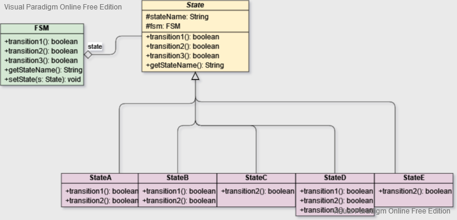

# Finite State Machine

This little project shows a way to approach the building of a [Finite State Machine](https://en.wikipedia.org/wiki/Finite-state_machine) (FSM) using the [State Design Pattern](https://en.wikipedia.org/wiki/State_pattern).

## The state machine

The FSM modeled is represented by the following diagram.

The diagram has been built using the free online tool at the link [http://www.madebyevan.com/fsm/](http://www.madebyevan.com/fsm/).

## The state pattern

In the state pattern different behaviors for a class are achieved through the usage of polymorphism: a context (in this case the FSM class) delegates operations to a State object and this object, at runtime, is an instance of a class that implements the State interface (even though in this case I used an abstract class instead of an interface).

Every concrete state class (in this case StateA, StateB, ... , StateE) defines the behavior for each transition which are represented by the methods **transition1**, **transition2** and **transition3**.

The uml diagram has been built with [Visual Paradigm Online Free Edition](https://online.visual-paradigm.com/drive/).

## Why an abstract class and not an interface

The reason why I preferred using an abstract class instead of an interface was to add a default behavior to the 3 transitions, making them "fail" by default. This way, for example, StateA doesn't need to implement the transition3 method since it's not contemplated by the finite state machine.

## Why returning a boolean for the transitions

On a similar note, I preferred returning a boolean value for the transition methods in order to provide for a bit of information to the method caller. The fact that the default implementation of the 3 transition methods returns false means that, by default, that action "fails". If we are in state A and try to execute the transition 3, in fact, the return value will be false: this tells us that the transition failed to execute.

The same logic could have been also implemented in other ways, for example by using exceptions.

In this little example project every <b>declared</b> transitions succeeds, but there are plenty of reasons why a transition could fail. Always as an example, we could model the transition 1 form A to B to fail if an exception occurs... we can catch that exception, do some stuff with it and then return false.

## Using the FSM

In the main method I provided an example of usage.
The little method asks for an input string that represents a series of transitions and executes the logic for those operations on the finite state machine.

For example, if we give the transition sequence 122321...

	> Starting state = A
	> Input a series of transitions (string with legal characters '1', '2' and '3'.
	> (Example: input '1122321' explores states A-B-A-C-D-E-D-A)
	> Transition string: 122321
	> State A --> Action 1
	> State B --> Action 2
	> State D --> Action 2
	> State D --> Action 3
	> State E --> Action 2
	> State D --> Action 1
	> OK. Reached state = A

As we can see the transition sequence is valid and the state reached after the sequence is the state A.

If we give an invalid transition sequence...

	> Starting state = A
	> Input a series of transitions (string with legal characters '1', '2' and '3'.
	> (Example: input '1122321' explores states A-B-A-C-D-E-D-A)
	> Transition string: 1232132
	> State A --> Action 1
	> State B --> Action 2
	> State D --> Action 3
	> State E --> Action 2
	> State D --> Action 1
	> Invalid transition sequence. Last state reached: A

After executing the transitions 1, 2, 3, 2, 1 in this order we find the state machine in state A. The next transition in the sequence is 3, but the state A doesn't provide the logic for transition 3, so the method that executes the sequence fails.

